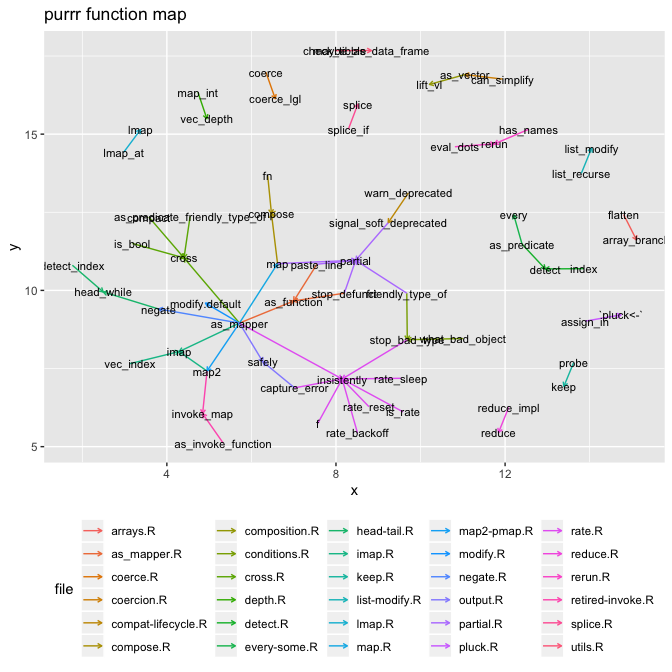

<!-- README.md is generated from README.Rmd. Please edit that file -->

# foreman

<!-- badges: start -->

[](https://www.tidyverse.org/lifecycle/#experimental)
<!-- badges: end -->

The goals of foreman are to:

  - [Unpack](#unpacking) a package’s functions to interrogate
    [relationships](#relationships) of the functions within it.
  - [Isolate](#subset) function scripts within a package (including the
    documentation for local paths)
  - [Consolidate](#consolidation) a subset of self contained functions
    in a file(s) to allow for focused learning on a specific package
    functionality.

> Given these goals it is important to state that this package is not
> meant to replace any parent package.

The package supports both [local packages](#local-packages) and
[compiled](#compiled-library) libraries.

## Installation

``` r
remotes::install_github("foreman")
```

## Local Packages

This example will use a local fork of `purrr`.

``` r
library(foreman)
library(ggraph)
library(igraph)
```

### Unpacking

Unpack a pacakge into a list

``` r
x <- unpack(path = '../forks/purrr/R', warn = FALSE)
```

Click the triangle to view the contents found in `arrays.R`

``` r
details::details(lapply(x$arrays.R,get_text),summary = 'arrays.R')
```

<details closed>

<summary> <span title="Click to Expand"> arrays.R </span> </summary>

``` r

$array_branch
 [1] "#' Coerce array to list"                                              
 [2] "#'"                                                                   
 [3] "#' `array_branch()` and `array_tree()` enable arrays to be"           
 [4] "#' used with purrr's functionals by turning them into lists. The"     
 [5] "#' details of the coercion are controlled by the `margin`"            
 [6] "#' argument. `array_tree()` creates an hierarchical list (a tree)"    
 [7] "#' that has as many levels as dimensions specified in `margin`,"      
 [8] "#' while `array_branch()` creates a flat list (by analogy, a"         
 [9] "#' branch) along all mentioned dimensions."                           
[10] "#'"                                                                   
[11] "#' When no margin is specified, all dimensions are used by"           
[12] "#' default. When `margin` is a numeric vector of length zero, the"    
[13] "#' whole array is wrapped in a list."                                 
[14] "#' @param array An array to coerce into a list."                      
[15] "#' @param margin A numeric vector indicating the positions of the"    
[16] "#'   indices to be to be enlisted. If `NULL`, a full margin is"       
[17] "#'   used. If `numeric(0)`, the array as a whole is wrapped in a"     
[18] "#'   list."                                                           
[19] "#' @name array-coercion"                                              
[20] "#' @export"                                                           
[21] "#' @examples"                                                         
[22] "#' # We create an array with 3 dimensions"                            
[23] "#' x <- array(1:12, c(2, 2, 3))"                                      
[24] "#'"                                                                   
[25] "#' # A full margin for such an array would be the vector 1:3. This is"
[26] "#' # the default if you don't specify a margin"                       
[27] "#'"                                                                   
[28] "#' # Creating a branch along the full margin is equivalent to"        
[29] "#' # as.list(array) and produces a list of size length(x):"           
[30] "#' array_branch(x) %>% str()"                                         
[31] "#'"                                                                   
[32] "#' # A branch along the first dimension yields a list of length 2"    
[33] "#' # with each element containing a 2x3 array:"                       
[34] "#' array_branch(x, 1) %>% str()"                                      
[35] "#'"                                                                   
[36] "#' # A branch along the first and third dimensions yields a list of"  
[37] "#' # length 2x3 whose elements contain a vector of length 2:"         
[38] "#' array_branch(x, c(1, 3)) %>% str()"                                
[39] "#'"                                                                   
[40] "#' # Creating a tree from the full margin creates a list of lists of" 
[41] "#' # lists:"                                                          
[42] "#' array_tree(x) %>% str()"                                           
[43] "#'"                                                                   
[44] "#' # The ordering and the depth of the tree are controlled by the"    
[45] "#' # margin argument:"                                                
[46] "#' array_tree(x, c(3, 1)) %>% str()"                                  
[47] "array_branch <- function(array, margin = NULL) {"                     
[48] "  dims <- dim(array) %||% length(array)"                              
[49] "  margin <- margin %||% seq_along(dims)"                              
[50] ""                                                                     
[51] "  if (length(margin) == 0) {"                                         
[52] "    list(array)"                                                      
[53] "  } else if (is.null(dim(array))) {"                                  
[54] "    if (!identical(as.integer(margin), 1L)) {"                        
[55] "      abort(sprintf("                                                 
[56] "        \"`margin` must be `NULL` or `1` with 1D arrays, not `%s`\"," 
[57] "        toString(margin)"                                             
[58] "      ))"                                                             
[59] "    }"                                                                
[60] "    as.list(array)"                                                   
[61] "  } else {"                                                           
[62] "    flatten(apply(array, margin, list))"                              
[63] "  }"                                                                  
[64] "}"                                                                    

$array_tree
 [1] "#' @rdname array-coercion"                                                     
 [2] "#' @export"                                                                    
 [3] "array_tree <- function(array, margin = NULL) {"                                
 [4] "  dims <- dim(array) %||% length(array)"                                       
 [5] "  margin <- margin %||% seq_along(dims)"                                       
 [6] ""                                                                              
 [7] "  if (length(margin) > 1) {"                                                   
 [8] "    new_margin <- ifelse(margin[-1] > margin[[1]], margin[-1] - 1, margin[-1])"
 [9] "    apply(array, margin[[1]], array_tree, new_margin)"                         
[10] "  } else {"                                                                    
[11] "    array_branch(array, margin)"                                               
[12] "  }"                                                                           
[13] "}"                                                                             
```

</details>

<br>

### Relationships

``` r
x_rel <- relationship(x)
```

Relationships contained in `arrays.R`

``` r
x_rel$arrays.R
#> $array_branch
#> [1] "flatten"
#> 
#> $array_tree
#> [1] "array_branch"
```

Functions that `compose` calls

``` r
relationship(x,parent = 'compose')
#> $compose.R
#> $compose.R$compose
#> [1] "compose" "map"     "fn"     
#> 
#> 
#> attr(,"class")
#> [1] "relationship" "list"
```

Functions who call `flatten`

``` r
relationship(x,child = 'flatten')
#> $arrays.R
#> $arrays.R$array_branch
#> [1] "flatten"
#> 
#> 
#> $lmap.R
#> $lmap.R$lmap_at
#> [1] "flatten"
#> 
#> 
#> $splice.R
#> $splice.R$splice_if
#> [1] "flatten"
#> 
#> 
#> attr(,"class")
#> [1] "relationship" "list"
```

### Convert relationships to a data.frame

``` r
x_rel_df <- as.data.frame(x_rel)
```

Click the triangle to view the data.frame

``` r
details::details(x_rel_df,summary = 'Relatives')
```

<details closed>

<summary> <span title="Click to Expand"> Relatives </span> </summary>

``` r

                           child                 parent               file
1                        flatten           array_branch           arrays.R
2                      as_mapper            as_function        as_mapper.R
3                   stop_defunct            as_function        as_mapper.R
4                     paste_line            as_function        as_mapper.R
5                         coerce             coerce_lgl           coerce.R
6                   can_simplify              as_vector         coercion.R
7                warn_deprecated signal_soft_deprecated compat-lifecycle.R
8                        compose                compose          compose.R
9                            map                compose          compose.R
10                            fn                compose          compose.R
11                     as_vector                lift_vl      composition.R
12               what_bad_object          stop_bad_type       conditions.R
13              friendly_type_of          stop_bad_type       conditions.R
14                     as_mapper                  cross            cross.R
15 as_predicate_friendly_type_of                  cross            cross.R
16                       compact                  cross            cross.R
17                       is_bool                  cross            cross.R
18                       map_int              vec_depth            depth.R
19                  as_predicate                 detect           detect.R
20                         index                 detect           detect.R
21                  as_predicate                  every       every-some.R
22                  detect_index             head_while        head-tail.R
23                        negate             head_while        head-tail.R
24                     as_mapper                   imap             imap.R
25                     vec_index                   imap             imap.R
26                          map2                   imap             imap.R
27                         probe                   keep             keep.R
28                  list_recurse            list_modify      list-modify.R
29                       lmap_at                   lmap             lmap.R
30                     as_mapper                    map              map.R
31                     as_mapper                   map2        map2-pmap.R
32                     as_mapper         modify.default           modify.R
33                     as_mapper                 negate           negate.R
34                     as_mapper                 safely           output.R
35                 capture_error                 safely           output.R
36        signal_soft_deprecated                partial          partial.R
37                  stop_defunct                partial          partial.R
38                           map                partial          partial.R
39                    paste_line                partial          partial.R
40              friendly_type_of                partial          partial.R
41                     assign_in              `pluck<-`            pluck.R
42                     as_mapper            insistently             rate.R
43                 stop_bad_type            insistently             rate.R
44                 capture_error            insistently             rate.R
45                  rate_backoff            insistently             rate.R
46                       is_rate            insistently             rate.R
47                    rate_sleep            insistently             rate.R
48                    rate_reset            insistently             rate.R
49                             f            insistently             rate.R
50                   reduce_impl                 reduce           reduce.R
51                     eval_dots                  rerun            rerun.R
52                     has_names                  rerun            rerun.R
53                          map2             invoke_map   retired-invoke.R
54            as_invoke_function             invoke_map   retired-invoke.R
55                     splice_if                 splice           splice.R
56                  check_tibble    maybe_as_data_frame            utils.R
```

</details>

<br>

### Plotting the relationships

``` r

graph <- igraph::graph_from_data_frame(x_rel_df,directed = TRUE)
```

``` r
igraph::V(graph)$parents <- names(igraph::V(graph))
```

``` r
ggraph(graph) +
  geom_edge_link(
    aes(colour = file),
    arrow = grid::arrow(length = unit(0.05, "inches"))) +
  geom_node_text(aes(label = parents),size = 3) +
  labs(title = 'purrr function map', colour = 'Exported') + 
  ggplot2::theme(legend.position   = 'bottom')
#> Using `nicely` as default layout
```



### Subset

Subsetting Package Functions

``` r
sub_x <- subset(x,'compose')
```

Click the triangle to view the contents found in the subset containing
`compose` and the functions the it calls.

``` r
details::details(lapply(sub_x,get_text),summary = 'Package subset')
```

<details closed>

<summary> <span title="Click to Expand"> Package subset </span>
</summary>

``` r

$compose.R
 [1] "#' Compose multiple functions"                                           
 [2] "#'"                                                                      
 [3] "#' @param ... Functions to apply in order (from right to left by"        
 [4] "#'   default). Formulas are converted to functions in the usual way."    
 [5] "#'"                                                                      
 [6] "#'   These dots support [tidy dots][rlang::list2] features. In"          
 [7] "#'   particular, if your functions are stored in a list, you can"        
 [8] "#'   splice that in with `!!!`."                                         
 [9] "#' @param .dir If `\"backward\"` (the default), the functions are called"
[10] "#'   in the reverse order, from right to left, as is conventional in"    
[11] "#'   mathematics. If `\"forward\"`, they are called from left to right." 
[12] "#' @return A function"                                                   
[13] "#' @export"                                                              
[14] "#' @examples"                                                            
[15] "#' not_null <- compose(`!`, is.null)"                                    
[16] "#' not_null(4)"                                                          
[17] "#' not_null(NULL)"                                                       
[18] "#'"                                                                      
[19] "#' add1 <- function(x) x + 1"                                            
[20] "#' compose(add1, add1)(8)"                                               
[21] "#'"                                                                      
[22] "#' # You can use the formula shortcut for functions:"                    
[23] "#' fn <- compose(~ paste(.x, \"foo\"), ~ paste(.x, \"bar\"))"            
[24] "#' fn(\"input\")"                                                        
[25] "#'"                                                                      
[26] "#' # Lists of functions can be spliced with !!!"                         
[27] "#' fns <- list("                                                         
[28] "#'   function(x) paste(x, \"foo\"),"                                     
[29] "#'   ~ paste(.x, \"bar\")"                                               
[30] "#' )"                                                                    
[31] "#' fn <- compose(!!!fns)"                                                
[32] "#' fn(\"input\")"                                                        
[33] "compose <- function(..., .dir = c(\"backward\", \"forward\")) {"         
[34] "  .dir <- arg_match(.dir, c(\"backward\", \"forward\"))"                 
[35] ""                                                                        
[36] "  fns <- map(list2(...), rlang::as_closure, env = caller_env())"         
[37] "  if (!length(fns)) {"                                                   
[38] "    # Return the identity function"                                      
[39] "    return(compose(function(x, ...) x))"                                 
[40] "  }"                                                                     
[41] ""                                                                        
[42] "  if (.dir == \"backward\") {"                                           
[43] "    n <- length(fns)"                                                    
[44] "    first_fn <- fns[[n]]"                                                
[45] "    fns <- rev(fns[-n])"                                                 
[46] "  } else {"                                                              
[47] "    first_fn <- fns[[1]]"                                                
[48] "    fns <- fns[-1]"                                                      
[49] "  }"                                                                     
[50] ""                                                                        
[51] "  body <- expr({"                                                        
[52] "    out <- !!fn_body(first_fn)"                                          
[53] ""                                                                        
[54] "    fns <- !!fns"                                                        
[55] "    for (fn in fns) {"                                                   
[56] "      out <- fn(out)"                                                    
[57] "    }"                                                                   
[58] ""                                                                        
[59] "    out"                                                                 
[60] "  })"                                                                    
[61] ""                                                                        
[62] "  structure("                                                            
[63] "    new_function(formals(first_fn), body, fn_env(first_fn)),"            
[64] "    class = c(\"purrr_function_compose\", \"function\"),"                
[65] "    first_fn = first_fn,"                                                
[66] "    fns = fns"                                                           
[67] "  )"                                                                     
[68] "}"                                                                       

$map.R
  [1] "#' Apply a function to each element of a vector"                              
  [2] "#'"                                                                           
  [3] "#' @description"                                                              
  [4] "#'"                                                                           
  [5] "#' The map functions transform their input by applying a function to"         
  [6] "#' each element and returning a vector the same length as the input."         
  [7] "#'"                                                                           
  [8] "#' * `map()`, `map_if()` and `map_at()` always return a list. See the"        
  [9] "#'   [modify()] family for versions that return an object of the same"        
 [10] "#'   type as the input."                                                      
 [11] "#'"                                                                           
 [12] "#'   The `_if` and `_at` variants take a predicate function `.p` that"        
 [13] "#'   determines which elements of `.x` are transformed with `.f`."            
 [14] "#'"                                                                           
 [15] "#' * `map_lgl()`, `map_int()`, `map_dbl()` and `map_chr()` each return"       
 [16] "#'    an atomic vector of the indicated type (or die trying)."                
 [17] "#'"                                                                           
 [18] "#'    The return value of `.f` must be of length one for each element of"     
 [19] "#'    `.x`. If `.f` uses an extractor function shortcut, `.default`"          
 [20] "#'    can be specified to handle values that are absent or empty.  See"       
 [21] "#'    [as_mapper()] for more on `.default`."                                  
 [22] "#'"                                                                           
 [23] "#' * `map_dfr()` and `map_dfc()` return data frames created by"               
 [24] "#'   row-binding and column-binding respectively. They require dplyr"         
 [25] "#'   to be installed."                                                        
 [26] "#'"                                                                           
 [27] "#' * `walk()` calls `.f` for its side-effect and returns the input `.x`."     
 [28] "#'"                                                                           
 [29] "#' @inheritParams as_mapper"                                                  
 [30] "#' @param .x A list or atomic vector."                                        
 [31] "#' @param .p A single predicate function, a formula describing such a"        
 [32] "#'   predicate function, or a logical vector of the same length as `.x`."     
 [33] "#'   Alternatively, if the elements of `.x` are themselves lists of"          
 [34] "#'   objects, a string indicating the name of a logical element in the"       
 [35] "#'   inner lists. Only those elements where `.p` evaluates to"                
 [36] "#'   `TRUE` will be modified."                                                
 [37] "#' @param .at A character vector of names, positive numeric vector of"        
 [38] "#'   positions to include, or a negative numeric vector of positions to"      
 [39] "#'   exlude. Only those elements corresponding to `.at` will be modified."    
 [40] "#' @param ... Additional arguments passed on to the mapped function."         
 [41] "#' @return All functions return a vector the same length as `.x`."            
 [42] "#'"                                                                           
 [43] "#'   `map()` returns a list, `map_lgl()` a logical vector, `map_int()` an"    
 [44] "#'   integer vector, `map_dbl()` a double vector, and `map_chr()` a character"
 [45] "#'   vector. The output of `.f` will be automatically typed upwards,"         
 [46] "#'   e.g. logical -> integer -> double -> character."                         
 [47] "#'"                                                                           
 [48] "#'   If `.x` has `names()`, the return value preserves those names."          
 [49] "#'"                                                                           
 [50] "#'   `walk()` returns the input `.x` (invisibly). This makes it easy to"      
 [51] "#'   use in pipe."                                                            
 [52] "#' @export"                                                                   
 [53] "#' @family map variants"                                                      
 [54] "#' @examples"                                                                 
 [55] "#' 1:10 %>%"                                                                  
 [56] "#'   map(rnorm, n = 10) %>%"                                                  
 [57] "#'   map_dbl(mean)"                                                           
 [58] "#'"                                                                           
 [59] "#' # Or use an anonymous function"                                            
 [60] "#' 1:10 %>%"                                                                  
 [61] "#'   map(function(x) rnorm(10, x))"                                           
 [62] "#'"                                                                           
 [63] "#' # Or a formula"                                                            
 [64] "#' 1:10 %>%"                                                                  
 [65] "#'   map(~ rnorm(10, .x))"                                                    
 [66] "#'"                                                                           
 [67] "#' # The names of the input are preserved in the output:"                     
 [68] "#' list(foo = 1, bar = 2) %>% map(`+`, 10)"                                   
 [69] "#'"                                                                           
 [70] "#' # Using set_names() with character vectors is handy to keep track"         
 [71] "#' # of the original inputs:"                                                 
 [72] "#' set_names(c(\"foo\", \"bar\")) %>% map_chr(paste0, \":suffix\")"           
 [73] "#'"                                                                           
 [74] "#' # Extract by name or position"                                             
 [75] "#' # .default specifies value for elements that are missing or NULL"          
 [76] "#' l1 <- list(list(a = 1L), list(a = NULL, b = 2L), list(b = 3L))"            
 [77] "#' l1 %>% map(\"a\", .default = \"???\")"                                     
 [78] "#' l1 %>% map_int(\"b\", .default = NA)"                                      
 [79] "#' l1 %>% map_int(2, .default = NA)"                                          
 [80] "#'"                                                                           
 [81] "#' # Supply multiple values to index deeply into a list"                      
 [82] "#' l2 <- list("                                                               
 [83] "#'   list(num = 1:3,     letters[1:3]),"                                      
 [84] "#'   list(num = 101:103, letters[4:6]),"                                      
 [85] "#'   list()"                                                                  
 [86] "#' )"                                                                         
 [87] "#' l2 %>% map(c(2, 2))"                                                       
 [88] "#'"                                                                           
 [89] "#' # Use a list to build an extractor that mixes numeric indices and names,"  
 [90] "#' # and .default to provide a default value if the element does not exist"   
 [91] "#' l2 %>% map(list(\"num\", 3))"                                              
 [92] "#' l2 %>% map_int(list(\"num\", 3), .default = NA)"                           
 [93] "#'"                                                                           
 [94] "#'"                                                                           
 [95] "#' # Use a predicate function to decide whether to map a function:"           
 [96] "#' map_if(iris, is.factor, as.character)"                                     
 [97] "#'"                                                                           
 [98] "#' # Specify an alternative with the `.else` argument:"                       
 [99] "#' map_if(iris, is.factor, as.character, .else = as.integer)"                 
[100] "#'"                                                                           
[101] "#' # A more realistic example: split a data frame into pieces, fit a"         
[102] "#' # model to each piece, summarise and extract R^2"                          
[103] "#' mtcars %>%"                                                                
[104] "#'   split(.$cyl) %>%"                                                        
[105] "#'   map(~ lm(mpg ~ wt, data = .x)) %>%"                                      
[106] "#'   map(summary) %>%"                                                        
[107] "#'   map_dbl(\"r.squared\")"                                                  
[108] "#'"                                                                           
[109] "#' # Use map_lgl(), map_dbl(), etc to reduce to a vector."                    
[110] "#' # * list"                                                                  
[111] "#' mtcars %>% map(sum)"                                                       
[112] "#' # * vector"                                                                
[113] "#' mtcars %>% map_dbl(sum)"                                                   
[114] "#'"                                                                           
[115] "#' # If each element of the output is a data frame, use"                      
[116] "#' # map_dfr to row-bind them together:"                                      
[117] "#' mtcars %>%"                                                                
[118] "#'   split(.$cyl) %>%"                                                        
[119] "#'   map(~ lm(mpg ~ wt, data = .x)) %>%"                                      
[120] "#'   map_dfr(~ as.data.frame(t(as.matrix(coef(.)))))"                         
[121] "#' # (if you also want to preserve the variable names see"                    
[122] "#' # the broom package)"                                                      
[123] "#'"                                                                           
[124] "#' # Use `map_depth()` to recursively traverse nested vectors and map"        
[125] "#' # a function at a certain depth:"                                          
[126] "#' x <- list(a = list(foo = 1:2, bar = 3:4), b = list(baz = 5:6))"            
[127] "#' str(x)"                                                                    
[128] "#' map_depth(x, 2, paste, collapse = \"/\")"                                  
[129] "#'"                                                                           
[130] "#' # Equivalent to:"                                                          
[131] "#' map(x, map, paste, collapse = \"/\")"                                      
[132] "map <- function(.x, .f, ...) {"                                               
[133] "  .f <- as_mapper(.f, ...)"                                                   
[134] "  .Call(map_impl, environment(), \".x\", \".f\", \"list\")"                   
[135] "}"                                                                            

$reduce.R
[1] "    fn <- function(x, y, ...) .f(y, x, ...)"
```

</details>

<br>

### Consolidation

Consolidating Subsetted Functions into a File

``` r
pack_path <- repack(sub_x)
#> Functions packed to /var/folders/kx/t4h_mm1910sb7vhm_gnfnx2c0000gn/T//Rtmpgg7cm0/foreman/unpacked.R
```

Click the triangle to view the contents found in the file containing the
consolidated
functions.

``` r
details::details(file.path(pack_path,'unpacked.R'),summary = 'Consolidated Script')
```

<details closed>

<summary> <span title="Click to Expand"> Consolidated Script </span>
</summary>

``` r

#Generated by foreman:

#' Compose multiple functions
#'
#' @param ... Functions to apply in order (from right to left by
#'   default). Formulas are converted to functions in the usual way.
#'
#'   These dots support [tidy dots][rlang::list2] features. In
#'   particular, if your functions are stored in a list, you can
#'   splice that in with `!!!`.
#' @param .dir If `"backward"` (the default), the functions are called
#'   in the reverse order, from right to left, as is conventional in
#'   mathematics. If `"forward"`, they are called from left to right.
#' @return A function
#' @export
#' @examples
#' not_null <- compose(`!`, is.null)
#' not_null(4)
#' not_null(NULL)
#'
#' add1 <- function(x) x + 1
#' compose(add1, add1)(8)
#'
#' # You can use the formula shortcut for functions:
#' fn <- compose(~ paste(.x, "foo"), ~ paste(.x, "bar"))
#' fn("input")
#'
#' # Lists of functions can be spliced with !!!
#' fns <- list(
#'   function(x) paste(x, "foo"),
#'   ~ paste(.x, "bar")
#' )
#' fn <- compose(!!!fns)
#' fn("input")
compose <- function(..., .dir = c("backward", "forward")) {
  .dir <- arg_match(.dir, c("backward", "forward"))

  fns <- map(list2(...), rlang::as_closure, env = caller_env())
  if (!length(fns)) {
    # Return the identity function
    return(compose(function(x, ...) x))
  }

  if (.dir == "backward") {
    n <- length(fns)
    first_fn <- fns[[n]]
    fns <- rev(fns[-n])
  } else {
    first_fn <- fns[[1]]
    fns <- fns[-1]
  }

  body <- expr({
    out <- !!fn_body(first_fn)

    fns <- !!fns
    for (fn in fns) {
      out <- fn(out)
    }

    out
  })

  structure(
    new_function(formals(first_fn), body, fn_env(first_fn)),
    class = c("purrr_function_compose", "function"),
    first_fn = first_fn,
    fns = fns
  )
}
#' Apply a function to each element of a vector
#'
#' @description
#'
#' The map functions transform their input by applying a function to
#' each element and returning a vector the same length as the input.
#'
#' * `map()`, `map_if()` and `map_at()` always return a list. See the
#'   [modify()] family for versions that return an object of the same
#'   type as the input.
#'
#'   The `_if` and `_at` variants take a predicate function `.p` that
#'   determines which elements of `.x` are transformed with `.f`.
#'
#' * `map_lgl()`, `map_int()`, `map_dbl()` and `map_chr()` each return
#'    an atomic vector of the indicated type (or die trying).
#'
#'    The return value of `.f` must be of length one for each element of
#'    `.x`. If `.f` uses an extractor function shortcut, `.default`
#'    can be specified to handle values that are absent or empty.  See
#'    [as_mapper()] for more on `.default`.
#'
#' * `map_dfr()` and `map_dfc()` return data frames created by
#'   row-binding and column-binding respectively. They require dplyr
#'   to be installed.
#'
#' * `walk()` calls `.f` for its side-effect and returns the input `.x`.
#'
#' @inheritParams as_mapper
#' @param .x A list or atomic vector.
#' @param .p A single predicate function, a formula describing such a
#'   predicate function, or a logical vector of the same length as `.x`.
#'   Alternatively, if the elements of `.x` are themselves lists of
#'   objects, a string indicating the name of a logical element in the
#'   inner lists. Only those elements where `.p` evaluates to
#'   `TRUE` will be modified.
#' @param .at A character vector of names, positive numeric vector of
#'   positions to include, or a negative numeric vector of positions to
#'   exlude. Only those elements corresponding to `.at` will be modified.
#' @param ... Additional arguments passed on to the mapped function.
#' @return All functions return a vector the same length as `.x`.
#'
#'   `map()` returns a list, `map_lgl()` a logical vector, `map_int()` an
#'   integer vector, `map_dbl()` a double vector, and `map_chr()` a character
#'   vector. The output of `.f` will be automatically typed upwards,
#'   e.g. logical -> integer -> double -> character.
#'
#'   If `.x` has `names()`, the return value preserves those names.
#'
#'   `walk()` returns the input `.x` (invisibly). This makes it easy to
#'   use in pipe.
#' @export
#' @family map variants
#' @examples
#' 1:10 %>%
#'   map(rnorm, n = 10) %>%
#'   map_dbl(mean)
#'
#' # Or use an anonymous function
#' 1:10 %>%
#'   map(function(x) rnorm(10, x))
#'
#' # Or a formula
#' 1:10 %>%
#'   map(~ rnorm(10, .x))
#'
#' # The names of the input are preserved in the output:
#' list(foo = 1, bar = 2) %>% map(`+`, 10)
#'
#' # Using set_names() with character vectors is handy to keep track
#' # of the original inputs:
#' set_names(c("foo", "bar")) %>% map_chr(paste0, ":suffix")
#'
#' # Extract by name or position
#' # .default specifies value for elements that are missing or NULL
#' l1 <- list(list(a = 1L), list(a = NULL, b = 2L), list(b = 3L))
#' l1 %>% map("a", .default = "???")
#' l1 %>% map_int("b", .default = NA)
#' l1 %>% map_int(2, .default = NA)
#'
#' # Supply multiple values to index deeply into a list
#' l2 <- list(
#'   list(num = 1:3,     letters[1:3]),
#'   list(num = 101:103, letters[4:6]),
#'   list()
#' )
#' l2 %>% map(c(2, 2))
#'
#' # Use a list to build an extractor that mixes numeric indices and names,
#' # and .default to provide a default value if the element does not exist
#' l2 %>% map(list("num", 3))
#' l2 %>% map_int(list("num", 3), .default = NA)
#'
#'
#' # Use a predicate function to decide whether to map a function:
#' map_if(iris, is.factor, as.character)
#'
#' # Specify an alternative with the `.else` argument:
#' map_if(iris, is.factor, as.character, .else = as.integer)
#'
#' # A more realistic example: split a data frame into pieces, fit a
#' # model to each piece, summarise and extract R^2
#' mtcars %>%
#'   split(.$cyl) %>%
#'   map(~ lm(mpg ~ wt, data = .x)) %>%
#'   map(summary) %>%
#'   map_dbl("r.squared")
#'
#' # Use map_lgl(), map_dbl(), etc to reduce to a vector.
#' # * list
#' mtcars %>% map(sum)
#' # * vector
#' mtcars %>% map_dbl(sum)
#'
#' # If each element of the output is a data frame, use
#' # map_dfr to row-bind them together:
#' mtcars %>%
#'   split(.$cyl) %>%
#'   map(~ lm(mpg ~ wt, data = .x)) %>%
#'   map_dfr(~ as.data.frame(t(as.matrix(coef(.)))))
#' # (if you also want to preserve the variable names see
#' # the broom package)
#'
#' # Use `map_depth()` to recursively traverse nested vectors and map
#' # a function at a certain depth:
#' x <- list(a = list(foo = 1:2, bar = 3:4), b = list(baz = 5:6))
#' str(x)
#' map_depth(x, 2, paste, collapse = "/")
#'
#' # Equivalent to:
#' map(x, map, paste, collapse = "/")
map <- function(.x, .f, ...) {
  .f <- as_mapper(.f, ...)
  .Call(map_impl, environment(), ".x", ".f", "list")
}
    fn <- function(x, y, ...) .f(y, x, ...)
```

</details>

<br>

### Compiled Library

This example will use the installed library `future`.

Using foreman with an compiled libraries is also simple

``` r
library(future)
#> 
#> Attaching package: 'future'
#> The following objects are masked from 'package:igraph':
#> 
#>     %->%, %<-%

unpacked_future <- unpack(ns = 'future')%>%
  relationship()%>%
  as.data.frame()
```

``` r

graph <- igraph::graph_from_data_frame(unpacked_future,directed = TRUE)
igraph::V(graph)$parents <- names(igraph::V(graph))
igraph::V(graph)$exported <- names(igraph::V(graph))%in%ls('package:future')
```

``` r
ggraph(graph) +
  geom_edge_link(
    arrow = grid::arrow(length = unit(0.05, "inches")),alpha = 0.05) +
  geom_node_text(aes(colour = exported,label = parents),size = 2) +
  labs(title = 'future function map', colour = 'Exported') + 
  ggplot2::theme(legend.position   = 'bottom')
#> Using `nicely` as default layout
```


